  

  
  
  
  
  
  

---

# 🚗 Awesome Autonomous Vehicle Development 🚘

> A curated directory of premier **SaaS platforms**, **open-source software stacks**, **synthetic data generators**, and **simulation tools** for **Autonomous Vehicle (AV) Development**, **ADAS Testing**, and **Robotics Fleet Validation**.

---

## 📌 Table of Contents
- [📊 Sector Market Overview](#-sector-market-overview)
- [💼 SaaS & Commercial Platforms](#-saas--commercial-platforms)
- [⚡ Open-Source Software & Simulators](#-open-source-software--simulators)
- [🛠️ Key Features & Ecosystem Comparison](#️-key-features--ecosystem-comparison)
- [🤝 How to Contribute](#-how-to-contribute)
- [💖 Support & Community](#-support--community)
- [📈 Star History](#-star-history)
- [⚠️ Disclaimer](#%EF%B8%8F-disclaimer)

---

## 📊 Sector Market Overview

> 🌐 **Market Size & Dynamics**: The global **Autonomous Vehicle Simulation & Validation Sector** is valued at approximately **$3.2 Billion in 2025** and is projected to expand to **$12.8 Billion by 2032** at a **21.5% CAGR**. The market is **moderately fragmented**, featuring high-growth enterprise infrastructure leaders (such as Applied Intuition, dSPACE, and Hexagon) alongside specialized physics engines, synthetic data platforms, and open-source stacks.

---

## 💼 SaaS & Commercial Platforms

Commercial platforms provide end-to-end hardware-in-the-loop (HIL) testing, photorealistic 3D environment generation, compliance verification (ISO 26262, SOTIF), and cloud-scale scenario validation.

*The table below is sorted by **Company Size / Valuation / Scale (Descending)**:*

| 🏢 Product / Platform | 📊 Company Size / Scale | 💰 Starting Price | 🎁 Free Tier / Trial Limits | 💡 Description |
| :--- | :--- | :--- | :--- | :--- |
| **[Hexagon Autonomy](https://hexagon.com/)** | $26.7B Market Cap (~$6.0B Rev) | $10,000 / year (Entry Suite) | 14-day evaluation demo on request (0 free forever plan) | High-precision positioning technology, sensor integration, and digital twin validation tools. |
| **[Applied Intuition](https://www.appliedintuition.com/)** | $15.0B Valuation ($415M ARR) | $50,000 / year (Starter Module) | 14-day evaluation sandbox access upon enterprise request | End-to-end toolchain for AV simulation, validation, Vehicle OS, and synthetic data management. |
| **[dSPACE](https://www.dspace.com/)** | $2.5B Est. Value (€460M Rev) | $15,000 / year (Engineering Seat) | 30-day trial license for enterprise; free academic bundle for universities | Hardware-in-the-loop (HIL) testing, sensor simulation, and virtual vehicle validation platforms. |
| **[Parallel Domain](https://paralleldomain.com/)** | $300M Est. Value ($15M ARR) | $0.05 / frame ($2,500/mo Starter) | 14-day free developer trial with 500 free synthetic frame generations | Photorealistic synthetic data generation and simulation platform for perception AI training. |
| **[Foretellix](https://www.fortellix.com/)** | $250M Est. Value ($20M ARR) | $20,000 / year (Foretify Suite) | 30-day proof-of-concept (PoC) trial license with dedicated sandbox support | Coverage-driven verification platform utilizing M-SDL for safety-critical scenario testing. |
| **[VI-grade](https://www.vi-grade.com/)** | $150M Est. Value ($40M Rev) | $150 / hour (Cloud On-Demand) | 1-day (8-hour) SimCenter pass for qualified OEM engineering teams | Driving simulators and cloud-based software solutions for vehicle dynamics and ADAS validation. |
| **[Cognata](https://www.cognata.com/)** | $100M Est. Value ($8M ARR) | $1,500 / month (Cloud Engine) | 14-day demo license with up to 100 scenario run executions | AI-driven simulation platform for ADAS and autonomous vehicle validation with 3D environments. |
| **[IPG CarMaker](https://ipg-automotive.com/)** | $60M Est. Value (€36M Rev) | $8,500 / year (CarMaker Office) | 6-week (42-day) test license; free Formula CarMaker program for student teams | Virtual vehicle development platform for testing autonomous driving functions and vehicle dynamics. |
| **[BeamNG.tech](https://www.beamng.tech/)** | $25M Est. Value ($15M Rev) | $1,200 / year (Commercial Node) | Free 1-year renewable academic license for verified students & researchers | Soft-body physics-based simulation platform providing realistic vehicle dynamics and sensor simulation. |
| **[CARLA Cloud](https://carla.org/)** | Cloud Hosted (AWS / GCP) | $0.526 / hour (AWS g4dn.xlarge) | GCP $300 free trial credits (90 days) / AWS Free Tier (12-month entry credit) | Cloud-hosted infrastructure for deploying and executing scalable open-source CARLA simulations. |

---

## ⚡ Open-Source Software & Simulators

Open-source autonomous driving software stacks, research simulators, and scenario runner frameworks provide transparent, vendor-independent solutions for self-driving vehicle development.

*The list below is sorted by **GitHub Star Counts (Descending)**:*

- 🏎️ **[commaai / openpilot](https://github.com/commaai/openpilot)**   
  Open-source driver assistance system supporting 250+ vehicle models with automated lane keeping, adaptive cruise control, and neural network driving policies.

- 🤖 **[ApolloAuto / apollo](https://github.com/ApolloAuto/apollo)**   
  Baidu's open autonomous driving platform providing a full-stack software architecture covering perception, localization, planning, control, Cyber RT runtime, and cloud services.

- 🛩️ **[microsoft / AirSim](https://github.com/microsoft/AirSim)**   
  Unreal Engine and Unity-based simulator for autonomous vehicles and drones, featuring hardware-in-the-loop experimentation and photorealistic sensor simulation.

- 🎓 **[udacity / self-driving-car](https://github.com/udacity/self-driving-car)**   
  Open-source autonomous vehicle project featuring deep learning pipelines, camera calibration, lane detection, and behavioral cloning neural networks.

- 🎮 **[lgsvl / simulator](https://github.com/lgsvl/simulator)**   
  Unity-based autonomous vehicle simulator from LG Electronics & Microsoft AI, providing seamless ROS, ROS2, and CyberRT integration with high-fidelity sensor models.

- 🏙️ **[carla-simulator / carla](https://github.com/carla-simulator/carla)**   
  The leading open-source simulator for autonomous driving research built on Unreal Engine 4. Features urban layouts, flexible sensor suites (LiDAR, cameras, RADAR, GNSS), ROS bridge, and Python/C++ APIs.

- 🚙 **[autowarefoundation / autoware](https://github.com/autowarefoundation/autoware)**   
  The premier open-source software stack for self-driving vehicles built on ROS2. Offers production-ready perception, localization, planning, and control modules for Level 4 autonomous driving.

- 📊 **[waymo-research / waymo-open-dataset](https://github.com/waymo-research/waymo-open-dataset)**   
  Official codebase and tools for the Waymo Open Dataset, providing high-resolution LiDAR and camera data along with 3D tracking and perception benchmarks.

- 🚦 **[eclipse-sumo / sumo](https://github.com/eclipse-sumo/sumo)**   
  Simulation of Urban MObility (SUMO) — an open-source, highly portable microscopic traffic simulation package designed for large-scale road networks and traffic management research.

- 📸 **[nutonomy / nuscenes-devkit](https://github.com/nutonomy/nuscenes-devkit)**   
  Devkit for the nuScenes public dataset for autonomous driving, featuring multi-modal sensor suites (32-beam LiDAR, 6 cameras, 5 radars) and evaluation metrics.

- 🛣️ **[decisionforce / metadrive](https://github.com/decisionforce/metadrive)**   
  Lightweight, highly efficient simulator for autonomous driving and reinforcement learning supporting procedural generation of infinite road layouts.

- 🧪 **[erdos-project / pylot](https://github.com/erdos-project/pylot)**   
  Modular autonomous driving platform that runs on both CARLA simulator and real-world vehicles, designed for computer vision and planning research.

- 📝 **[berkeley-deep-drive / scenic](https://github.com/berkeley-deep-drive/scenic)**   
  Domain-specific programming language and scenario description compiler for specifying probabilistic spatial configurations and testing autonomous systems.

- 🎬 **[carla-simulator / scenario_runner](https://github.com/carla-simulator/scenario_runner)**   
  Traffic scenario definition and execution engine for CARLA, enabling reproducible testing of safety-critical traffic situations like cut-ins and pedestrian crossings.

- 🔗 **[carla-simulator / ros-bridge](https://github.com/carla-simulator/ros-bridge)**   
  ROS and ROS2 bridge for CARLA Simulator, enabling seamless message exchange with ROS-based autonomous driving software stacks including Autoware.

- 🌐 **[tier4 / AWSIM](https://github.com/tier4/AWSIM)**   
  TIER IV's open-source Unity-based autonomous driving simulator designed as a native reference simulation environment for Autoware Universe.

- 🚘 **[Habrador / Self-driving-vehicle](https://github.com/Habrador/Self-driving-vehicle)**   
  Unity-based simulation environment implementing Hybrid A* pathfinding and motion planning algorithms for self-driving vehicles.

- 📡 **[usdot-fhwa-stol / carma-platform](https://github.com/usdot-fhwa-stol/carma-platform)**   
  USDOT FHWA's Cooperative Driving Automation (CDA) platform built on ROS, enabling V2X (vehicle-to-everything) communication and collaborative driving maneuvers.

- 🏆 **[carla-simulator / leaderboard](https://github.com/carla-simulator/leaderboard)**   
  Official CARLA benchmark leaderboard for evaluating autonomous driving agents across standardized route scenarios and driving metrics.

---

## 🛠️ Key Features & Ecosystem Comparison

- 🖥️ **High-Fidelity Simulation**: Combine **CARLA** or **AirSim** for Unreal Engine graphics with **Autoware** or **Apollo** for Level 4 production software stacks.
- 🎯 **Scenario & Safety Verification**: Utilize **Foretellix (M-SDL)** or **Scenic** for automated scenario coverage and probabilistic edge-case discovery.
- 🔬 **Sensor Fusion & Synthetic Data**: Leverage **Parallel Domain** or **Applied Intuition** to generate labeled synthetic datasets for camera, LiDAR, and RADAR perception model training.
- ⚙️ **Hardware-in-the-Loop (HIL)**: Deploy **dSPACE** or **VI-grade** for real-time ECU testing and physical simulator motion platforms.

---

## 🤝 How to Contribute

1. 🍴 **Fork the repository**.
2. 📝 **Add your SaaS or Open-Source project** to `README.md` following the existing markdown table or star-sorted list format.
3. ✅ **Ensure description includes** target use case, licensing/pricing model, and verified links.
4. 🚀 **Submit a Pull Request** with a brief summary of the added solution.

---

## 💖 Support & Community

If you find this repository helpful in your autonomous vehicle research, engineering, or project development, please consider showing your support:

- ⭐ **Star this repository** to help others discover it!
- 🔀 **Fork it** to contribute new SaaS platforms or open-source tools.
- 📢 **Share it** with your colleagues, research groups, and developer networks.
- ☕ **Buy me a coffee / Sponsor**: Support the maintenance of this repository via [GitHub Sponsors](https://github.com/sponsors/ishandutta2007)!

  

---

## 📈 Star History

---

## ⚠️ Disclaimer

- ℹ️ This directory is **community-curated** for educational and research purposes.
- 🛑 Autonomous driving software and simulation systems deployed on public roads must comply with safety standards (e.g., ISO 26262, SOTIF) and regional regulatory approvals.

---

  <b>Crafted with ❤️ for Automotive Engineers, Robotics Researchers, AV Developers, and Mobility Innovators.</b>

